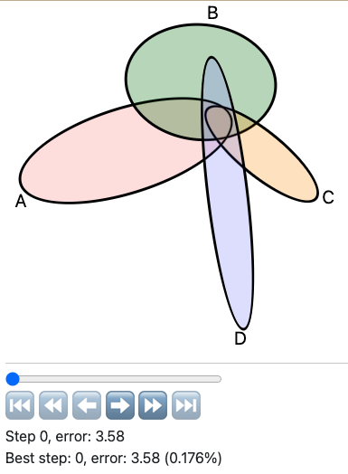
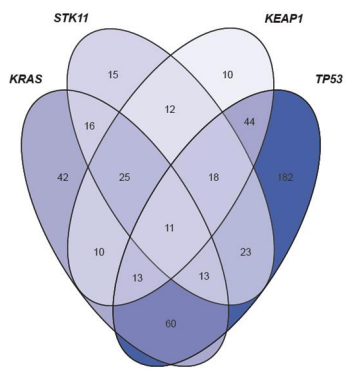

# ∧p∨d
Area-Proportional Venn Diagram generator (WIP)

<!-- toc -->
- [Demo: gradient descent toward target region sizes](#demo)
- [Background](#background)
    - [Prior art](#prior-art)
    - [Into the ellipse](#ellipses)
        - [4 sets](#4-sets)
    - [Future directions](#future-directions)
        - [Polygons](#polygons)
        - [Splines](#splines)
- [Methods](#methods)
- [Status](#status)
    - [Earlier versions of apvd](#earlier)
        - [Draggable ellipses demo](#draggable-ellipses)
        - [Scala.js port](#scala)
- [Other references](#misc)
    - [combinatorics.org Survey](#survey)
        - [5 symmetric triangles](#5-triangles)
        - [6 triangles](#6-triangles)
        - [Polyominoes](#polyominoes)
    - [Related libraries](#libs)
        - [Rust](#rust)
        - [JS](#js)
<!-- /toc -->

## Demo: gradient descent toward target region sizes 

https://github.com/runsascoded/apvd/assets/465045/87b3c520-3413-41a1-9ea6-c2281c2fc68c

- Live demo: [runsascoded.com/apvd]
- "Targets" and initial layout can be configured via the "Examples" and "Layouts" drop-downs
- Uses [runsascoded/shapes] to compute intersections + areas, in terms of circle's center/radius gradients, and gradient-descend to target proportions

## Background 
Years ago, I saw this plot in [a genomics paper](https://www.ncbi.nlm.nih.gov/pmc/articles/PMC3753564/pdf/btt375.pdf):

I thought:
1. It's neat that 4 ellipses can intersect to form all 15 ($2^4-1$) possible regions (that's impossible with 4 circles)
2. It's weird that the areas are wildly disproportionate to the numbers they represent (e.g. there's a region labeled "1" that's larger than an adjacent "112")

I was curious whether the areas could be made to be _proportional_ to the numbers they represent.
After reading up on it, it seemed that generating **"area-proportional Venn diagrams"** was essentially an open problem.

### Prior art 
[Ben Frederickson] made a [circle-based generator][benfred generator] in 2013-2015 that seemed to be the state of the art:

However, many inputs are impossible to model using circles, including the example above: $|A \cap B \cap C|$ should be equal to $|A \cap B \setminus C|$ and $|A \cap C \setminus B|$, and twice the size of $|B \cap C \setminus A|$, but it's smaller than all three. Running apvd on this input corroborates that three circles can only get within about 7% of these values:

https://github.com/runsascoded/apvd/assets/465045/b9dce3e3-04b2-4bf2-bdbf-ec6605be24ce

*([initial layout](https://runsascoded.com/apvd#s=dzg0000002000b40001KSuQ000m900000008000&t=i16,16,4,12,4,3,2), [best approximation](https://runsascoded.com/apvd#s=dzkLaS9NJi2a9X40RLai8lAdzUS2yypU-VNeqvq&t=i16,16,4,12,4,3,2); the reported "7.36%" error is "[earth-mover distance](https://en.wikipedia.org/wiki/Earth_mover%27s_distance)", as a percentage of the overall diagram size)*

### Into the ellipse 
Generalizing the shapes to be ellipses allows the example above to converge:

https://github.com/runsascoded/apvd/assets/465045/9bc6e73d-bd7c-4795-a0fb-348fa7de6805

*([initial layout](https://runsascoded.com/apvd#s=8zg0000002000400000004g0006XpXg000w0000000yg000000200040000000&t=i16,16,4,12,4,3,2), [converged](https://runsascoded.com/apvd#s=8zj3y26orq6Z8jzNF07Rj4o4yZ8ldsdmTmBm0L_CeMyjDVG4S0O0EDOW8r_LhR&t=i16,16,4,12,4,3,2))*

Each ellipse has 2 more degrees of freedom than a circle (2 radii instead of 1, and a rotation parameter), which allows for representing many more 3- and 4-set inputs than circles can.

#### 4 sets 
As noted [above](#motivation), ellipses allow for meaningfully representing intersections of up to 4 sets.

Here's the best layout I've found for [the "variant callers" example](#motivation):

*([live link](https://runsascoded.com/apvd#s=Mzxv4Cc95664TAhIgtTaZ1wTbpB32hca6RnYrxzN5QRgbF4oaXr5MStC6KxNYYZy5g5IuzaS1moF4lLWtIXXY-VOO2f8wNvsQk9Jqqfg0B-RDkXMZTCTpTaymPnuwF-vswFGRVwFE4hgScC1ofXRaBdnvzm84fjZ8wtEkWHaqiifUM4TVEtIbh8&t=633,618,112,187,0,14,1,319,13,55,17,21,0,9,36))*

≈0.176% error is pretty good! Less than 1/500th of the diagram above is in the wrong "region" (subset of the 4 top-level sets).

There's various low-hanging [improvements][apvd issues] to be made, but the ability to compute such layouts is an essentially novel capability, afaik.

### Future directions 

#### Polygons 
My approach should be extensible to arbitrary polygons (including non-convex), which would allow for intersections of 5 (or more?) sets.

I suspect the usefulness of even a perfect layout at that level to be limited, but it would be nice to have the option, and 5-set diagrams [exist in the wild](https://www.hindawi.com/journals/bmri/2015/456479/):

Polygons with rounded corners should also be doable, and might be more aesthetically pleasing.

#### Splines 
Cubic-bezier splines would be ideal, but the math is much harder; I'm not sure how to compute it exactly (using my autodiff-based approach).

[This SO answer](https://stackoverflow.com/a/15845996) quotes a lost forum post outlining how to use [the divergence theorem](https://en.wikipedia.org/wiki/Divergence_theorem) to compute the area of a poly-bezier loop. It's possible that (or some approximation that is nevertheless autodiff-able) would work…

## Methods 
My approach in this library is to:
1. model a "scene" with various intersecting shapes
2. compute intersection points
3. infer regions and sizes for each subset of the set of shapes
4. compute error ($|desired size - actual size|$, for all regions)
5. gradient-descend the shapes' coordinates (e.g. center x/y and radius x/y) in the direction of decreasing error

Several of these steps turn out to be nontrivial, especially:
- computing intersection points between 2 ellipses (involves solving a quartic equation, as ellipses can intersect in up to 4 points)
- propagating useful gradients through all calculations (requires an autodiff abstraction, and some care to avoid numeric instability)

## Status 
The demo at [runsascoded.com/apvd] supports up to 4 ellipses (including allowing them to rotate relative to the axes), and arbitrary initial layouts and target region-sizes. It can gradient-descend for 10,000's of steps and converge, or reach negligible error levels, on most examples I've tested it on (several of which are linked under "Examples" in the demo app).

Future work could involve:
- command-line / server-based version (evolving models from multiple initial layouts in parallel)
- more shapes (rectangles, polygons, splines)
- more ability to configure examples, and save and share state

### Earlier versions of apvd 

#### Draggable ellipses demo 
I previously implemented an interface for computing ellipse intersections, which included draggable and resizable shapes:

https://github.com/runsascoded/apvd/assets/465045/108e974d-f103-4005-9762-732c25f8cb7b

*(live demo: [runsascoded.com/apvd/ellipses])*

It's implemented in JS, pre-[shapes][runsascoded/shapes], and computes intersections and region sizes, but isn't differentiable / can't gradient-descend.

#### Scala.js port 
There's also a partial [Scala.js] implementation in [this repo's @scala branch](https://github.com/runsascoded/apvd/tree/scala), including [cubic](https://github.com/runsascoded/apvd/tree/scala/cubic/shared/src/main/scala/cubic) and [quartic](https://github.com/runsascoded/apvd/tree/scala/quartic/shared/src/main/scala/quartic) equation solvers.

## Other references 

### Venn Diagrams in the wild 

https://pubmed.ncbi.nlm.nih.gov/35190375/ (supplement, pg. 13): https://jitc.bmj.com/content/jitc/10/2/e003027.full.pdf

### combinatorics.org Survey 
https://www.combinatorics.org/files/Surveys/ds5/ds5v3-2005/VennEJC.html

#### 5 symmetric triangles 

https://www.combinatorics.org/files/Surveys/ds5/ds5v3-2005/VennSymmExamples.html

#### 6 triangles 

https://www.combinatorics.org/files/Surveys/ds5/ds5v3-2005/VennTriangleEJC.html

#### Polyominoes 
https://www.combinatorics.org/files/Surveys/ds5/ds5v3-2005/VennPoly67EJC.html

> Shown below is a 6-Venn diagram formed entirely from curves drawn from axis-aligned edges. It is a minimum-area diagram; that is, each region is composed of a single square of unit area. Note that many edges overlap, so the diagram is [infinitely intersecting](https://www.combinatorics.org/files/Surveys/ds5/ds5v3-2005/VennOtherEJC.html#infinite). As with many other diagrams in these pages, regions are coloured by weight. The diagrams on this page are from \[[CR05](https://www.combinatorics.org/files/Surveys/ds5/ds5v3-2005/VennRefs.html#CR05)\].
> 
>
> The six component curves of the diagram, overlaid on a grayed-out version of the entire diagram:
> 
>
> This is a 7-Venn diagram formed entirely from curves drawn from axis-aligned edges. Like the above it is minimum-area and infinitely intersecting.
>
> 
>
> The seven component curves:
>
> 

### Related libraries 

These libraries aim to convey set relationships:
- [venneuler R package](https://www.rforge.net/venneuler/) ([paper](https://www.cs.uic.edu/~wilkinson/Publications/venneuler.pdf))
- [UpSet plots](https://en.wikipedia.org/wiki/UpSet_Plot)

Some other relevant libraries I've used or studied:
#### Rust 
Dual / Autodiff libraries:
- https://github.com/itt-ustutt/num-dual ([r/rust](https://www.reddit.com/r/rust/comments/ybi9yx/automatic_differentiation_and_thermodynamics_with/))
- https://crates.io/crates/hyperdual/
- https://github.com/elrnv/autodiff
- https://github.com/djmaxus/autodj
- https://github.com/raskr/rust-autograd includes reverse-mode
- ~https://docs.rs/dual_num/latest/dual_num/~ (archived)
- https://crates.io/crates/fwd_ad 3yrs stale
- https://gist.github.com/emilk/c027311e5d0e8b69953c83a3ec283b74
- https://docs.rs/roots/latest/roots/ real roots only

#### JS 
[quartic.js](https://www.npmjs.com/package/quartic) (last release 2008)
Core code is from a [web solver](http://www.akiti.ca/Quad4Deg.html) written by [David Binner](http://www.akiti.ca/ContactPage.html)

[runsascoded/shapes]: https://github.com/runsascoded/shapes
[Ben Frederickson]: https://github.com/benfred
[benfred generator]: https://www.benfrederickson.com/venn-diagrams-with-d3.js/
[pages/ellipses.tsx]: https://github.com/runsascoded/apvd/blob/main/pages/ellipses.tsx
[runsascoded.com/apvd/ellipses]: https://runsascoded.com/apvd/ellipses
[runsascoded.com/apvd]: https://runsascoded.com/apvd
[apvd issues]: https://github.com/runsascoded/apvd/issues
[shapes issues]: https://github.com/runsascoded/shapes/issues
[Scala.js]: https://www.scala-js.org/
