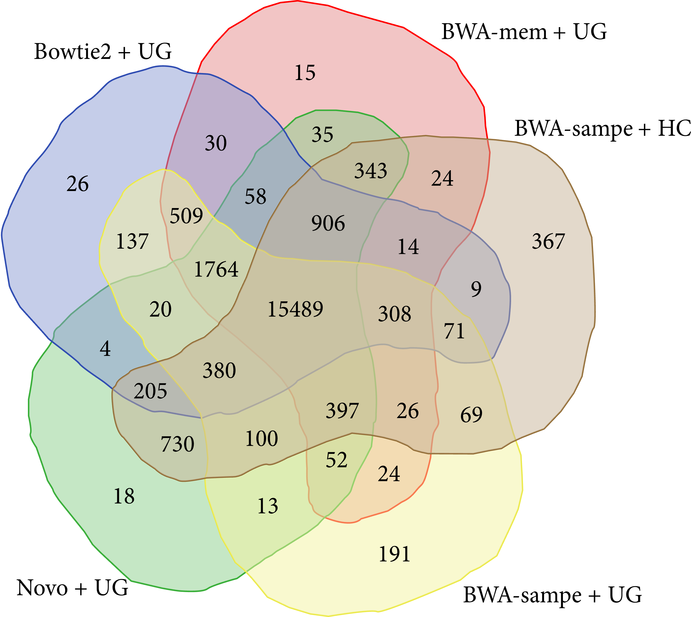
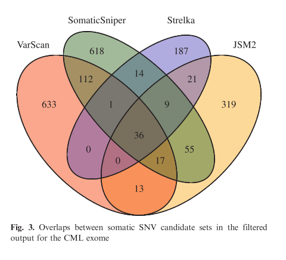
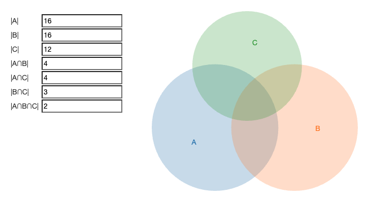
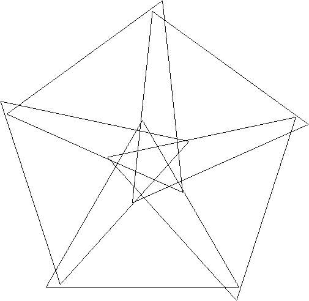
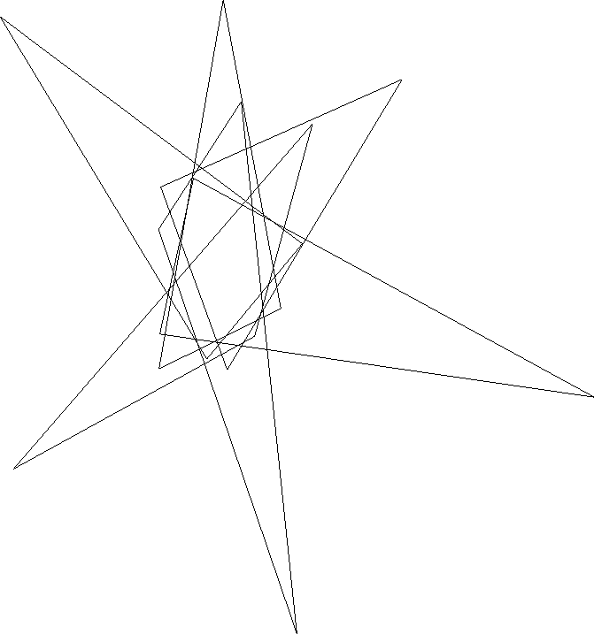
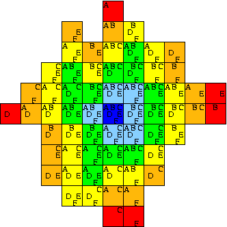
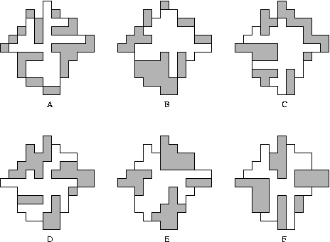
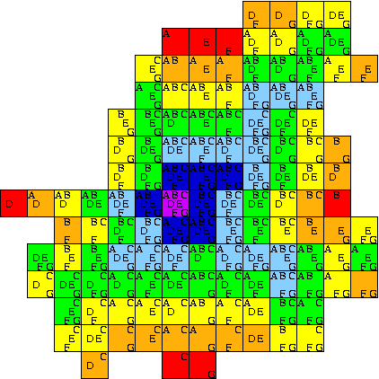
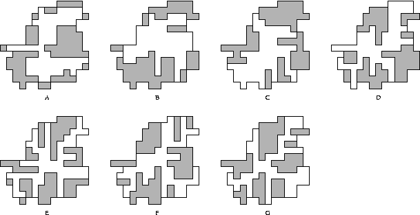

# ∧p∨d
Area-Proportional Venn Diagram generator (WIP)

<!-- toc -->
- [Demos](#demos)
    - [Gradient descent toward target region sizes: runsascoded.com/apvd](#demo)
    - [Draggable ellipses + intersections: runsascoded.com/apvd/ellipses](#ellipses)
- [Status](#status)
- [Inspiration](#inspo)
    - [Non-area-proportional Venn Diagrams in papers](#papers)
    - [Area-proportional Venn Diagrams (circles only)](#circles)
    - [combinatorics.org Survey](#survey)
        - [5 symmetric triangles](#5-triangles)
        - [6 triangles](#6-triangles)
        - [Polyominoes](#polyominoes)
- [Other misc references](#misc)
    - [Rust](#rust)
    - [JS](#js)
    - [Scala](#scala)
<!-- /toc -->

## Demos 

### Gradient descent toward target region sizes: [runsascoded.com/apvd](https://runsascoded.com/apvd) 

https://github.com/runsascoded/apvd/assets/465045/52733e34-1603-43c1-8fc1-99afbd008df2

(*uses [runsascoded/shapes] to compute intersections + areas, in terms of circle's center/radius gradients, and gradient-descend to target proportions*)

### Draggable ellipses + intersections: [runsascoded.com/apvd/ellipses](https://runsascoded.com/apvd/ellipses) 

https://github.com/runsascoded/apvd/assets/465045/2bcaa761-1989-4d6e-8424-8b593759fb53

(*+ projections where each ellipse becomes a unit circle; useful for computing / debugging intersections*)

## Status 
- [x] Compute ellipse intersections / areas
- Autodiff computations + gradient-descend to optimal solution (see [runsascoded/shapes])
  - [x] circles
  - [ ] ellipses (WIP)
    - hit numeric-stability issues with "roots" crate quartic solver ([roots#30](https://github.com/vorot/roots/issues/30))
    - working on one [in runsascoded/shapes](https://github.com/runsascoded/shapes/blob/e2d0d1bfd3e8c25ba8bb73f2066b374347de261d/src/math/quartic.rs#L219-L238)
  - [ ] polygons?

## Inspiration 

### Non-area-proportional Venn Diagrams in papers 

https://www.hindawi.com/journals/bmri/2015/456479/

https://www.ncbi.nlm.nih.gov/pmc/articles/PMC3753564/pdf/btt375.pdf

### Area-proportional Venn Diagrams (circles only) 

[Blog (2013)](https://www.benfrederickson.com/venn-diagrams-with-d3.js/), [follow-up (2013)](https://www.benfrederickson.com/calculating-the-intersection-of-3-or-more-circles/), [benfred/venn.js](https://github.com/benfred/venn.js), [upsetjs/venn.js](https://github.com/upsetjs/venn.js)

### combinatorics.org Survey 
https://www.combinatorics.org/files/Surveys/ds5/ds5v3-2005/VennEJC.html

#### 5 symmetric triangles 

https://www.combinatorics.org/files/Surveys/ds5/ds5v3-2005/VennSymmExamples.html

#### 6 triangles 

https://www.combinatorics.org/files/Surveys/ds5/ds5v3-2005/VennTriangleEJC.html

#### Polyominoes 
https://www.combinatorics.org/files/Surveys/ds5/ds5v3-2005/VennPoly67EJC.html

> Shown below is a 6-Venn diagram formed entirely from curves drawn from axis-aligned edges. It is a minimum-area diagram; that is, each region is composed of a single square of unit area. Note that many edges overlap, so the diagram is [infinitely intersecting](https://www.combinatorics.org/files/Surveys/ds5/ds5v3-2005/VennOtherEJC.html#infinite). As with many other diagrams in these pages, regions are coloured by weight. The diagrams on this page are from \[[CR05](https://www.combinatorics.org/files/Surveys/ds5/ds5v3-2005/VennRefs.html#CR05)\].
> 
>
> The six component curves of the diagram, overlaid on a grayed-out version of the entire diagram:
> 
>
> This is a 7-Venn diagram formed entirely from curves drawn from axis-aligned edges. Like the above it is minimum-area and infinitely intersecting.
>
> 
>
> The seven component curves:
>
> 

## Other misc references 
- [venneuler R package](https://www.rforge.net/venneuler/) ([paper](https://www.cs.uic.edu/~wilkinson/Publications/venneuler.pdf))

### Rust 
Dual / Autodiff libraries:
- https://github.com/itt-ustutt/num-dual ([r/rust](https://www.reddit.com/r/rust/comments/ybi9yx/automatic_differentiation_and_thermodynamics_with/))
- https://crates.io/crates/hyperdual/
- https://github.com/elrnv/autodiff
- https://github.com/djmaxus/autodj
- https://github.com/raskr/rust-autograd includes reverse-mode
- ~https://docs.rs/dual_num/latest/dual_num/~ (archived)
- https://crates.io/crates/fwd_ad 3yrs stale
- https://gist.github.com/emilk/c027311e5d0e8b69953c83a3ec283b74
- https://docs.rs/roots/latest/roots/ real roots only

### JS 
[quartic.js](https://www.npmjs.com/package/quartic) (last release 2008)
Core code is from a [web solver](http://www.akiti.ca/Quad4Deg.html) written by [David Binner](http://www.akiti.ca/ContactPage.html)

### Scala 
Partial Scala.js implementation in [this repo's @scala branch](https://github.com/runsascoded/apvd/tree/scala), including [cubic](https://github.com/runsascoded/apvd/tree/scala/cubic/shared/src/main/scala/cubic) and [quartic](https://github.com/runsascoded/apvd/tree/scala/quartic/shared/src/main/scala/quartic) equation solvers.

[runsascoded/shapes]: https://github.com/runsascoded/shapes
