# ∧p∨d
Area-Proportional Venn Diagram generator (WIP)

<!-- toc -->
- [Demo: gradient descent toward target region sizes](#demo)
- [Examples](#examples)
    - [4 Ellipses](#4-ellipses)
    - [3 Circles](#3-circles)
- [Background](#background)
- [Prior art](#prior-art)
    - [Area-proportional + Ellipses](#area-proportional-ellipses)
    - [Area-proportional + Circles](#area-proportional-circles)
    - [Non-area-proportional](#non-area-proportional)
- [Status](#status)
- [Methods](#methods)
    - [Quartic equation-solving for ellipse intersections](#quartic)
    - [Autodiff](#autodiff)
- [Future directions](#future-directions)
    - [Better "missing region" penalty](#missing-region-penalty)
    - [Proportional errors](#proportional-errors)
    - [More shape types](#shapes)
- [Other notes/references](#misc)
    - [Earlier versions of apvd](#earlier)
    - [combinatorics.org Survey](#survey)
    - [Related libraries](#libs)
<!-- /toc -->

## Demo: gradient descent toward target region sizes 

Live app: [runsascoded.com/apvd]:

https://github.com/runsascoded/apvd/assets/465045/87b3c520-3413-41a1-9ea6-c2281c2fc68c

The "Targets" and "Layouts" sections allow configuring the target region sizes and type/arrangement of shapes.

It's faily "alpha" (see [/issues]), but I believe it's "state of the art" at creating area-proportional Venn diagrams using up to 4 ellipses.

## Examples 

### 4 Ellipses 

#### [N.D. Roberts et al, 2013][Roberts 2013] 

[Here's the best layout][Variant callers - best] I've found using ∧p∨d:

The error is just under 0.2%: about 1/500th of the overall area is in the wrong region.

Here's a closer look at the center, with region-size labels:

The "1.86" (Red ∩ Blue ∩ Yellow) should be 0, and there a missing { Red ∩ Green ∩ Yellow } of size 1. I use a rudimentary penalty that moves shapes closer together when a region is missing (the converse happens naturally via gradient descent), but [it could definitely be made smarter](#missing-region-penalty).

Definitely lots of low-hanging UX improvements as well!

#### [West et al, 2013][mpower] 
From [the supplement][mpower supplement]:

∧p∨d [struggles a bit][mpower best] with this one:

Error is 22.9 (4.64%); half of that is { Red ∩ Yellow ∩ Blue }, which is 1.56 instead of 12. [Incorporating each region's relative error](#proportional-errors) would likely produce more intuitive results (see [shapes#9]).

(Also, the "182" for "TP53 only" is on the { TP53 ∩ STK11 } region; TODO!)

[//]: # ( &#40;[supplement][mpower supplement], pg. 13&#41;: "Clinical efficacy of atezolizumab plus bevacizumab and chemotherapy in KRAS- mutated non-small cell lung cancer with STK11, KEAP1, or TP53 comutations: subgroup results from the phase III IMpower150 trial.")

#### [Zhang et al, 2014][Zhang 2014] 

Also [discussed by Lior Pachter][lior pachter zhang 2014]:

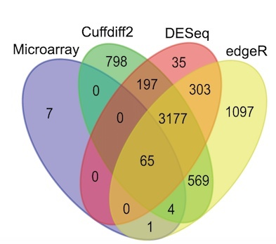

This one basically [converges][zhang 2014 best], though it took 100k's of steps:

Clearly there's room to improve the label positioning…

### 3 Circles 
TODO: show ∧p∨d solutions to these…

#### [Mann (2011)] [Mann (2011)] 

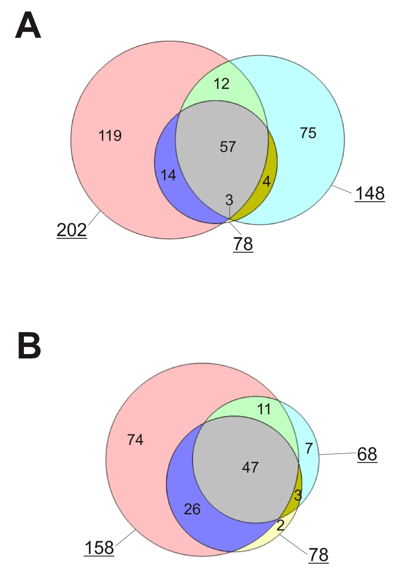

#### [Regenbrecht (2008)] 

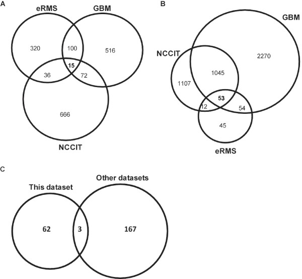

#### [Lenz (2006)] 

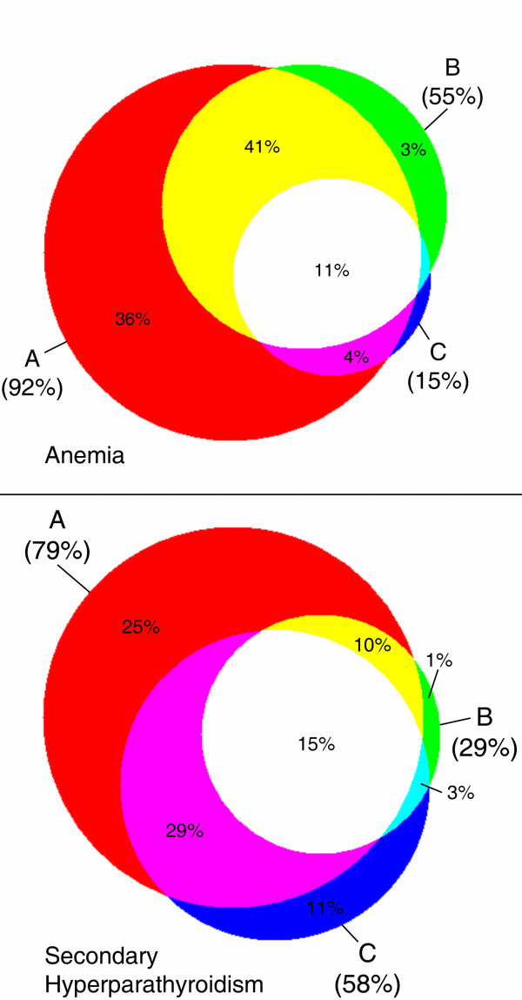

## Background 
When I first saw diagrams like this in the wild, I hadn't realized that 4 ellipses can intersect to form all 15 ($2^4-1$) possible regions. I knew it was impossible with 4 circles, but the added power from slightly relaxing the shapes was intriguing!

The wildly disproportionate areas bugged me, though. I read up on it a bit, and found some relatively accessible open problems related to generating **"area-proportional Venn diagrams"**.

I believe this library pushes the state of the art forward a bit (e.g. by supporting 4 ellipses), and hopefully provides a platform for further progress.

## Prior art 

### Area-proportional + Ellipses 

#### eulerAPE 
[Java applet][eulerAPE], up to 3 ellipses, area-proportional:

Here is its solution to [the example above](#benfred):

[Their paper][eulerAPE paper] is a great reference, and includes many examples from published papers.

#### [Edeap] 
[Web app][Edeap], "Euler Diagrams Drawn with Ellipses Area-Proportionally (Edeap)":

The area-proportionality seems pretty imprecise, in this example and others. It seems to use a force-directed algorithm that doesn't actually seek a perfect/converged solutions.

### Area-proportional + Circles 

Several tools generate area-proportional Venn diagrams using circles, but this doesn't allow for modeling most inputs.

For example, here's ∧p∨d trying to fit the first example below using three circles:

https://github.com/runsascoded/apvd/assets/465045/b9dce3e3-04b2-4bf2-bdbf-ec6605be24ce

*([initial layout](https://runsascoded.com/apvd#s=dzg0000002000b40001KSuQ000m900000008000&t=i16,16,4,12,4,3,2), [best approximation](https://runsascoded.com/apvd#s=dzkLaS9NJi2a9X40RLai8lAdzUS2yypU-VNeqvq&t=i16,16,4,12,4,3,2); the reported "7.36%" error is "[earth-mover distance](https://en.wikipedia.org/wiki/Earth_mover%27s_distance)", as a percentage of the overall diagram size)*

Allowing just one set to be an ellipse (even "aligned" to the axes, with no rotation) is enough for this diagram to [converge][benfred example one ellipse convergence]:

#### "Venn Diagrams with D3.js" 
[Web app][benfred generator], 3 circles:

Note that the solution above is imprecise: $|A \cap B \cap C|$ should be equal to $|A \cap B \setminus C|$ and $|A \cap C \setminus B|$, and twice the size of $|B \cap C \setminus A|$, but it's smaller than all three. See [discussion above](#area-proportional-circles) about ellipses supporting convergence for this example.

#### [BioVenn] 
- [Web app][BioVenn], [Python package][BioVenn Python], R package
- Up to 3 circles

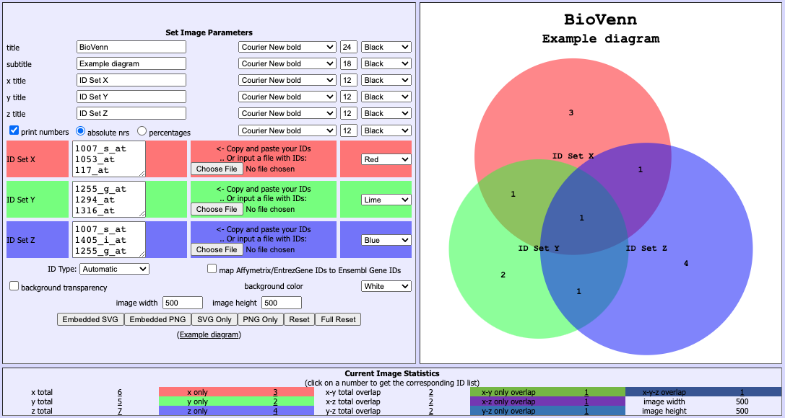

#### [DeepVenn] 
[Web app][DeepVenn] by the [BioVenn](#biovenn) author, up to 10 sets, circles only:
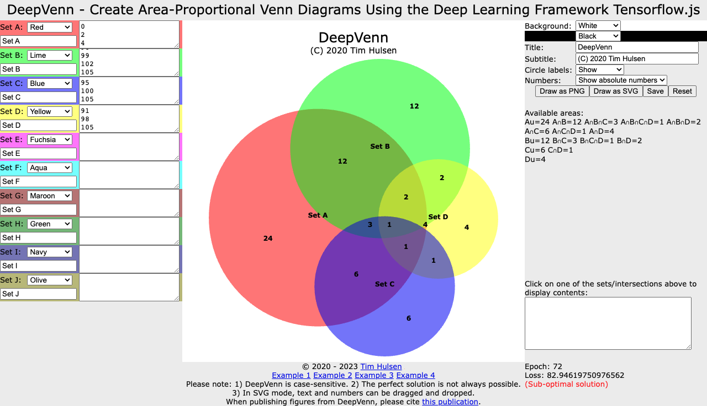

#### [Venn-Diagram-Plotter] 
Windows executable, 2-3 circles:

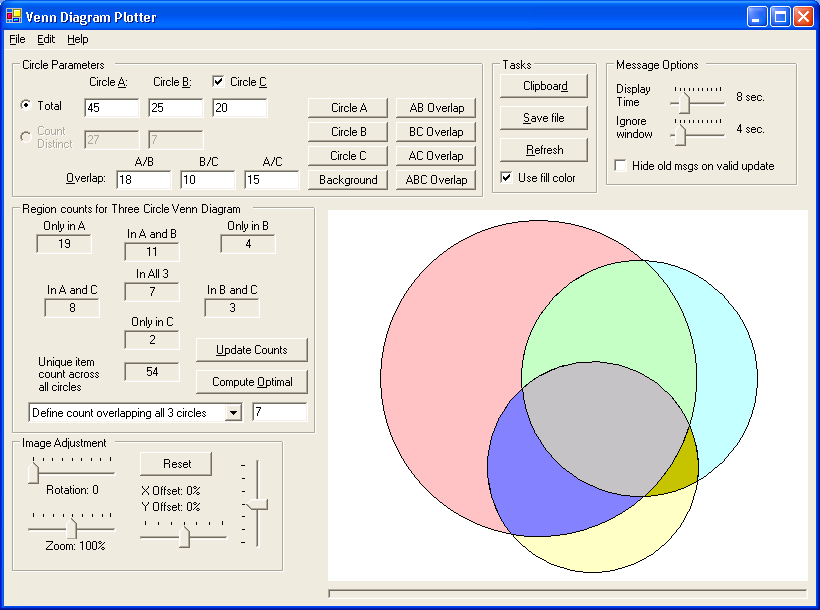

### Non-area-proportional 

#### [InteractiVenn] 

Not area-proportional, but will draw up to 6 sets:

#### [Venny] 

[Web app][Venny], up to 4 ellipses, not area-proportional:

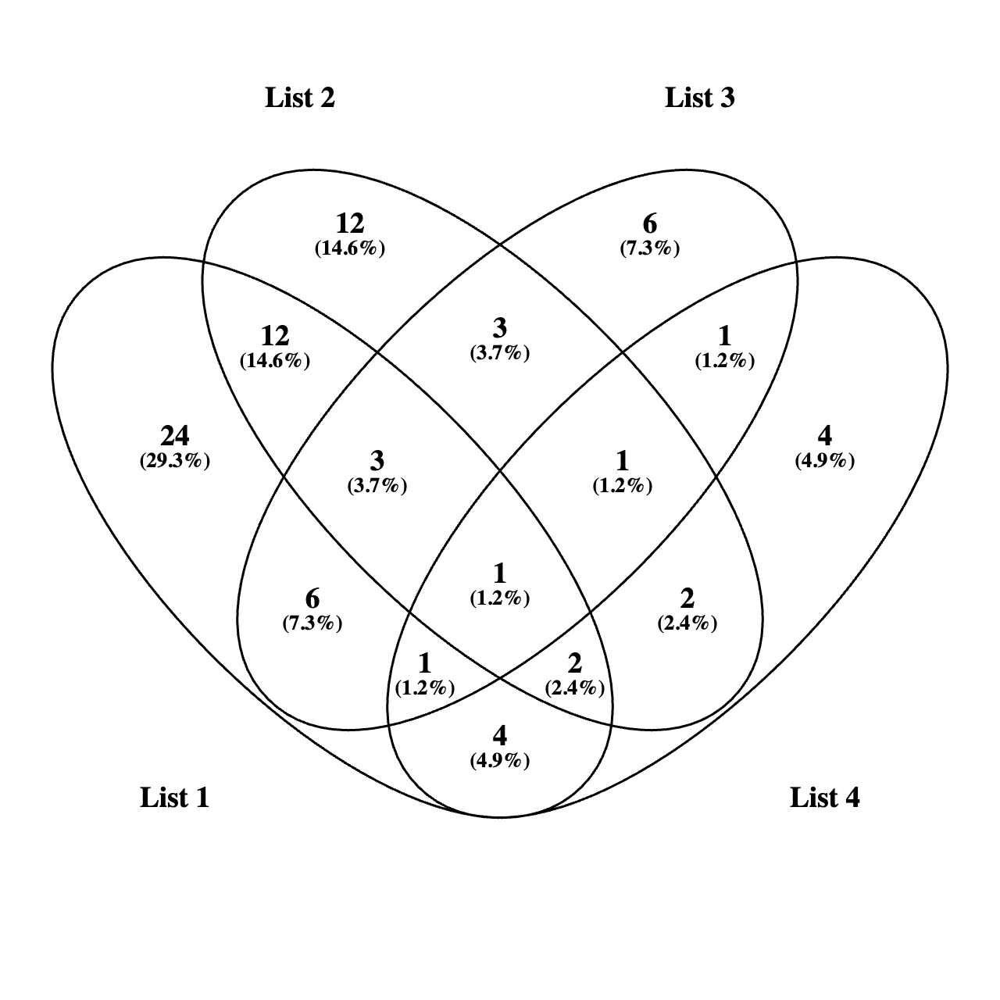

#### [Pangloss] 
[Web app][Pangloss], up to 4 rectangles, not area-proportional:

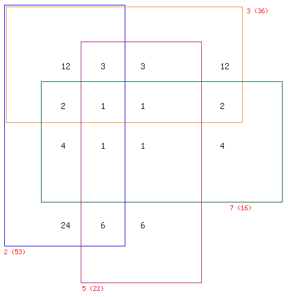

#### [ggVennDiagram] 

R package, 2-7 sets, not area-proportional:

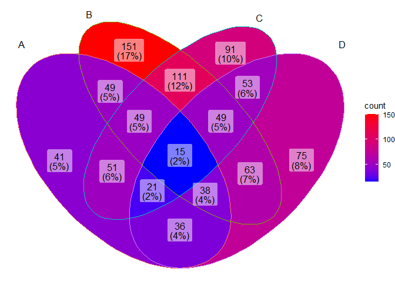

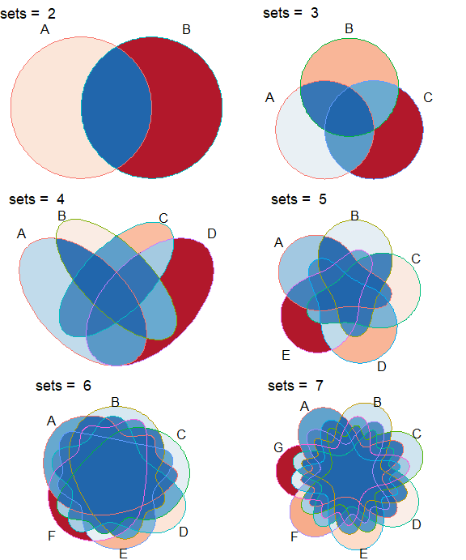

#### [UGent Venn Diagram Generator] 

[Web app][UGent Venn Diagram Generator], up to 5 sets, not area-proportional:

## Status 
The demo at [runsascoded.com/apvd] supports up to 4 ellipses (including allowing them to rotate relative to the axes), and arbitrary initial layouts and target region-sizes. It can gradient-descend for 100,000's of steps and converge, or reach negligible error levels, on most [examples](#examples) I've tested it on.

Future work could involve:
- command-line / server-based version (evolving models from multiple initial layouts in parallel)
- more shapes (rectangles, polygons, splines)
- more ability to configure examples, and save and share state

See [/issues] for more info.

## Methods 
This repo is primarily the "frontend" / web app; the interesting computation occurs in [runsascoded/shapes].

The basic approach is to:
1. model a "scene" with various intersecting shapes
2. compute intersection points
3. infer regions and sizes for each subset of the set of shapes
4. compute error ($|desired size - actual size|$, for all regions)
5. gradient-descend the shapes' coordinates (e.g. center x/y and radius x/y) in the direction of decreasing error

Several of these steps turn out to be nontrivial, especially:
- computing intersection points between 2 ellipses (involves solving a quartic equation, as ellipses can intersect in up to 4 points)
- propagating useful gradients through all calculations (requires an autodiff abstraction, and some care to avoid numeric instability)

### Quartic equation-solving for ellipse intersections 
Computing ellipse intersections can be represented as solving a system of equations that looks like:

$$
A_1x^2 + B_1xy + C_1y^2 + D_1x + E_1y + F_1 = 0 \\
A_2x^2 + B_2xy + C_2y^2 + D_2x + E_2y + F_2 = 0 \\
$$

With some algebraic manipulation, this can be represented as a quartic equation. I initially used the Rust [roots] crate, but hit issues ([#29][roots#29], [#30][roots#30]), and wrote [`quartic.rs`] instead.

The [nb/](./nb) folder contains notebooks with relevant math and derivations, especially:
- [intersect-circles.ipynb](nb/intersect-circles.ipynb)
- [quartics.ipynb](nb/quartics.ipynb)
- [cubics.ipynb](nb/cubics.ipynb)

### Autodiff 
Most of the computations related to shapes' intersections and corresponding region areas are differentiable. I use a thin wrapper ([`dual.rs`]) around [`num_dual`]'s [`DualDVec64`] for this. 

[shapes#1] describes moving to statically-sized Duals, which would likely be faster, and make the code much cleaner.

## Future directions 

### Better "missing region" penalty 
The "missing region penalty" should be proportional to the distance each shape is from the required region existing. This would allow shapes to rotate to get closer, whereas currently I just move their centers closer together, which often ends up thrashing against added error in other regions.

More discussion at [shapes#10].

### Proportional errors 
Currently, absolute difference between target and actual region sizes is all that is considered. Incorporating relative error is appealing, but it raises questions about what to do with missing or erroneous (shouldn't exist but do) regions.

A mix of absolute and relative may be most intuitive/aesthetic; more discussion on [shapes#9].

### More shape types 
See also: [shapes#11].

#### Polygons 
My approach should be extensible to arbitrary polygons (including non-convex), which would allow for intersections of 5 (or more?) sets.

I suspect the usefulness of even a perfect layout at that level to be limited, but it would be nice to have the option, and 5-set diagrams [exist in the wild](https://www.hindawi.com/journals/bmri/2015/456479/):

Polygons with rounded corners should also be doable, and might be more aesthetically pleasing.

#### Splines 
Cubic-bezier splines would be ideal, but the math is much harder; I'm not sure how to compute it exactly (using my autodiff-based approach).

[This SO answer](https://stackoverflow.com/a/15845996) quotes a lost forum post outlining how to use [the divergence theorem](https://en.wikipedia.org/wiki/Divergence_theorem) to compute the area of a poly-bezier loop. It's possible that (or some approximation that is nevertheless autodiff-able) would work…

## Other notes/references 
- [List of Venn diagram tools for bioinformaticians][dlcompbiobiotech tool list]
- [RectEuler]: many links to other tools
- [Vsauce twitter thread]
- [O'Rawe et al 2013]: 3- and 5-set Venn diagrmas

### Earlier versions of apvd 

#### Draggable ellipses demo 
I previously implemented an interface for computing ellipse intersections, which included draggable and resizable shapes:

https://github.com/runsascoded/apvd/assets/465045/108e974d-f103-4005-9762-732c25f8cb7b

*(live demo: [runsascoded.com/apvd/ellipses])*

It's implemented in JS, pre-[shapes][runsascoded/shapes], and computes intersections and region sizes, but isn't differentiable / can't gradient-descend.

#### Scala.js port 
There's also a partial [Scala.js] implementation in [this repo's @scala branch](https://github.com/runsascoded/apvd/tree/scala), including [cubic](https://github.com/runsascoded/apvd/tree/scala/cubic/shared/src/main/scala/cubic) and [quartic](https://github.com/runsascoded/apvd/tree/scala/quartic/shared/src/main/scala/quartic) equation solvers.

### combinatorics.org Survey 
https://www.combinatorics.org/files/Surveys/ds5/ds5v3-2005/VennEJC.html

#### 5 symmetric triangles 

https://www.combinatorics.org/files/Surveys/ds5/ds5v3-2005/VennSymmExamples.html

#### 6 triangles 

https://www.combinatorics.org/files/Surveys/ds5/ds5v3-2005/VennTriangleEJC.html

#### Polyominoes 
https://www.combinatorics.org/files/Surveys/ds5/ds5v3-2005/VennPoly67EJC.html

> Shown below is a 6-Venn diagram formed entirely from curves drawn from axis-aligned edges. It is a minimum-area diagram; that is, each region is composed of a single square of unit area. Note that many edges overlap, so the diagram is [infinitely intersecting](https://www.combinatorics.org/files/Surveys/ds5/ds5v3-2005/VennOtherEJC.html#infinite). As with many other diagrams in these pages, regions are coloured by weight. The diagrams on this page are from \[[CR05](https://www.combinatorics.org/files/Surveys/ds5/ds5v3-2005/VennRefs.html#CR05)\].
> 
> 
>
> The six component curves of the diagram, overlaid on a grayed-out version of the entire diagram:
> 
> 
>
> This is a 7-Venn diagram formed entirely from curves drawn from axis-aligned edges. Like the above it is minimum-area and infinitely intersecting.
>
> 
>
> The seven component curves:
>
> 
>

### Related libraries 

These libraries aim to convey set relationships:
- [venneuler R package](https://www.rforge.net/venneuler/) ([paper](https://www.cs.uic.edu/~wilkinson/Publications/venneuler.pdf))
- [UpSet plots](https://en.wikipedia.org/wiki/UpSet_Plot)

Some other relevant libraries I've used or studied:
#### Rust 
Dual / Autodiff libraries:
- https://github.com/itt-ustutt/num-dual ([r/rust](https://www.reddit.com/r/rust/comments/ybi9yx/automatic_differentiation_and_thermodynamics_with/))
- https://crates.io/crates/hyperdual/
- https://github.com/elrnv/autodiff
- https://github.com/djmaxus/autodj
- https://github.com/raskr/rust-autograd includes reverse-mode
- ~https://docs.rs/dual_num/latest/dual_num/~ (archived)
- https://crates.io/crates/fwd_ad 3yrs stale
- https://gist.github.com/emilk/c027311e5d0e8b69953c83a3ec283b74
- https://docs.rs/roots/latest/roots/ real roots only

#### JS 
[quartic.js](https://www.npmjs.com/package/quartic) (last release 2008)
Core code is from a [web solver](http://www.akiti.ca/Quad4Deg.html) written by [David Binner](http://www.akiti.ca/ContactPage.html)

[runsascoded/shapes]: https://github.com/runsascoded/shapes
[Ben Frederickson]: https://github.com/benfred
[benfred generator]: https://www.benfrederickson.com/venn-diagrams-with-d3.js/
[pages/ellipses.tsx]: https://github.com/runsascoded/apvd/blob/main/pages/ellipses.tsx
[runsascoded.com/apvd/ellipses]: https://runsascoded.com/apvd/ellipses
[runsascoded.com/apvd]: https://runsascoded.com/apvd
[/issues]: https://github.com/runsascoded/apvd/issues
[shapes issues]: https://github.com/runsascoded/shapes/issues
[Scala.js]: https://www.scala-js.org/
[benfred example one ellipse convergence]: https://runsascoded.com/apvd#s=dxw86-opKzMOrH2jOCzPEwDxATi9k2QwqTW9HhX8NLe&t=i16,16,4,12,4,3,2
[eulerAPE paper]: https://journals.plos.org/plosone/article?id=10.1371/journal.pone.0101717

[Roberts 2013]: https://www.ncbi.nlm.nih.gov/pmc/articles/PMC3753564/pdf/btt375.pdf
[Variant callers - best]: https://runsascoded.com/apvd#s=Mzx868wSrqe62oBeRfH2WUHakKB1OeVQltXVsxzG7xr1hF4oblIulnX_D1OLV6jNkgSlDvFN0OqgyD3OUuvX_X_5HhRUwN1mnF1uXKhW4bbNv4zNby2cxv2iiFbpHovsstMTrteKR4hgh43U5qPl9TqywzTQ4efn1ARs8VrIS_u6Ew57sD7lVHg&t=633,618,112,187,0,14,1,319,13,55,17,21,0,9,36&n=VarScan,SomaticSniper,Strelka=T@#99f,JSM2@orange

[mpower]: https://pubmed.ncbi.nlm.nih.gov/35190375/
[mpower supplement]: https://jitc.bmj.com/content/jitc/10/2/e003027.full.pdf?with-ds=yes
[mpower best]: https://runsascoded.com/apvd#t=42,15,16,10,10,12,25,182,60,23,13,44,13,18,11&n=KRAS,STK11,KEAP1=P,TP53&s=MBa-DFxenUIPbbiY5zWUS75Sq6I_AoND3lCDN4c5cpbpL14Esh6Saq4ZExG4o8gjJ5dU0BbxsOy7d-X6u50CMd2V366UA1Ds8GIODVbI8YXEowhIyWjyf6ehH6Rv7XRt1FQ7iPZML4xDayY-CF36Azp1g3lboFO9072ceizTenkvUwA4t0T4bSM

[lior pachter zhang 2014]: https://liorpachter.wordpress.com/2017/08/02/how-not-to-perform-a-differential-expression-analysis-or-science/
[Zhang 2014]: https://journals.plos.org/plosone/article?id=10.1371/journal.pone.0103207
[zhang 2014 best]: https://runsascoded.com/apvd#t=7,798,0,35,0,197,0,1097,1,569,4,303,0,3177,65&n=Microarray@#99f,Cuffdiff2,DESeq@#f99,edgeR@orange&s=MzmxcXrZYyppkecbYAfg4H-PdpCaRWiDeq7N44wuiJNlIm4wp8P8cuwA9Bucsmjr2dqn1zPM22wgGd1JSY0rISvxh2mUA2aXH3ag_t6G_89D8KxZnwOU6jB2JskrLQgrA2jCCHogg4hv96qke6qJW22g22WkvD-Ra6KpOXm4rQ50Y4pkpWQmTtE

[Mann (2011)]: https://proteomesci.biomedcentral.com/articles/10.1186/1477-5956-9-7
[Regenbrecht (2008)]: https://www.ncbi.nlm.nih.gov/pmc/articles/PMC2577110/
[Lenz (2006)]: https://www.ncbi.nlm.nih.gov/pmc/articles/PMC1713248/

[eulerAPE]: http://www.eulerdiagrams.org/eulerAPE/
[BioVenn]: https://www.biovenn.nl/
[BioVenn Python]: https://pypi.org/project/BioVenn/
[BioVenn R]: https://cran.r-project.org/package=BioVenn
[Venn-Diagram-Plotter]: https://pnnl-comp-mass-spec.github.io/Venn-Diagram-Plotter/
[DeepVenn]: https://deepvenn.com/
[Venny]: https://bioinfogp.cnb.csic.es/tools/venny/index.html
[Venny BioStars]: https://www.biostars.org/p/77362/

[dlcompbiobiotech tool list]: https://www.dlcompbiobiotech.com/2022/01/list-of-venn-diagram-tools-for.html
[RectEuler]: https://onlinelibrary.wiley.com/doi/10.1111/cgf.14814
[Edeap]: https://www.eulerdiagrams.org/edeap
[InteractiVenn]: http://www.interactivenn.net/
[Pangloss]: http://www.pangloss.com/seidel/Protocols/venn4.cgi
[ggvenndiagram]: https://github.com/gaospecial/ggVennDiagram
[UGent Venn Diagram Generator]: https://bioinformatics.psb.ugent.be/webtools/Venn/

[roots]: https://github.com/vorot/roots
[roots#29]: https://github.com/vorot/roots/issues/29
[roots#30]: https://github.com/vorot/roots/issues/30
[`quartic.rs`]: https://github.com/runsascoded/shapes/blob/dev/src/math/quartic.rs
[`dual.rs`]: https://github.com/runsascoded/shapes/blob/dev/src/dual.rs
[`num_dual`]: https://docs.rs/num-dual/latest/num_dual/
[`DualDVec64`]: https://docs.rs/num-dual/latest/num_dual/type.DualDVec64.html
[shapes#1]: https://github.com/runsascoded/shapes/issues/1
[shapes#9]: https://github.com/runsascoded/shapes/issues/9
[shapes#10]: https://github.com/runsascoded/shapes/issues/10
[shapes#11]: https://github.com/runsascoded/shapes/issues/11

[Vsauce twitter thread]: https://twitter.com/tweetsauce/status/1108498701427732481
[O'Rawe et al 2013]: https://genomemedicine.biomedcentral.com/counter/pdf/10.1186/gm432.pdf?site=genomemedicine.biomedcentral.com
